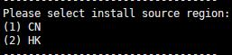

## 环境要求

使用前，请检查您的环境是否满足要求：

+ CentOS-7-x86_64bit，主机商推荐使用阿里云或谷歌云
+ 不低于4GB的内存
+ 已安装Python 2.7.x

## 下载及安装
执行以下命令进行下载和安装：

    yum install -y wget && wget -O install.sh https://swan-release.oss-cn-shanghai.aliyuncs.com/version/install.sh && sh install.sh

安装过程中，需要您依次确认如下配置：

1. 当命令行显示如下内容时，请输入1并回车。

    
    

2. 当命令行显示如下内容时，如您的主机位于内地，请输入1并回车；如您的主机位于其他地区，请输入2并回车。不同的地区会选择不同的下载源，请您根据实际情况选择。

    
    

确认如上两个配置后，稍候片刻即可。

安装完成后，将会显示后台管理地址，请在防火墙配置中打开对应端口以及56439端口，完成后您可以通过该地址进入管理页面。